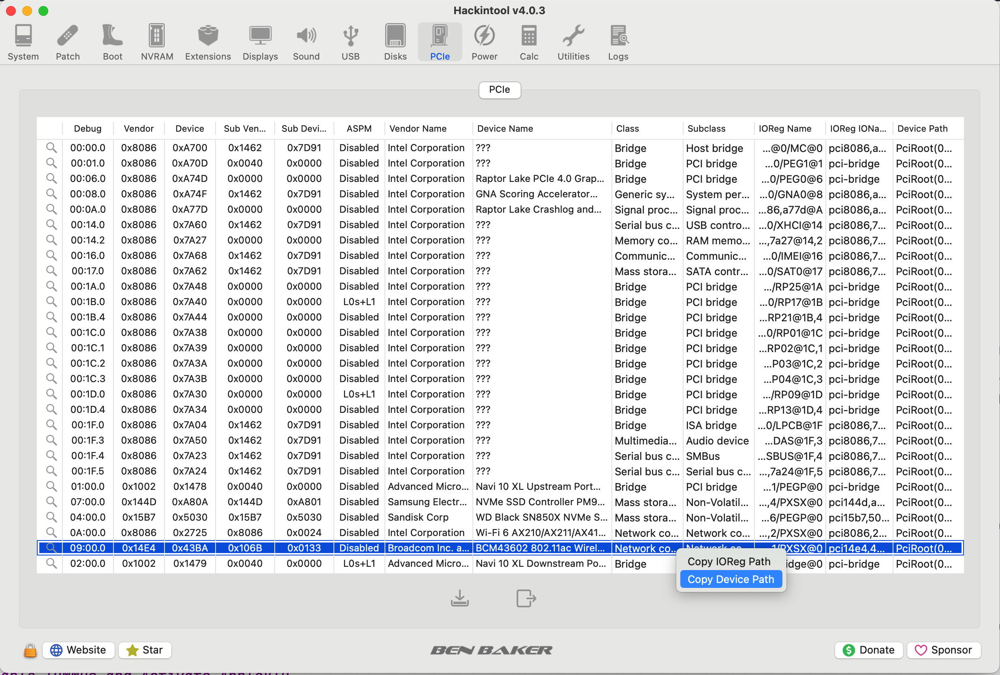

# Getting Started

This document provides a step-by-step guide for using BCMC with your Broadcom FullMAC Wi-Fi cards. This guide assumes that you have basic knowledge of how to edit your bootloader configuration file `config.plist` and install kernel extensions (kexts) via the bootloader. **Please go through each step carefully.**

## Check Your Wi-Fi Chip

Please make sure that your Wi-Fi chip is supported by checking its PCI Device ID.

## Check Your System Version

Please make sure that your current macOS version is supported.

## Check Your System Integrity

BCMC relies on Apple's new Broadcom Wi-Fi driver and 802.11 wireless networking stack, you must make sure that system frameworks and libraries related to those components remain uncontaminated. That said, if you have already applied Wi-Fi-related root patches via the OpenCore Legacy Patcher, you must revert them first. This includes removing related kexts and configurations from `config.plist`. Below is a list of kexts and configurations to check. Note that this list may not be complete, so please refer to the guide you used when applying the root patches.

- Remove `AMFIPass.kext` that turns off Apple's Mobile File Integrity protection.
- Remove `IOSkywalkFamily.kext` that downgrades the Skywalk networking stack.
- Remove `IO80211FamilyLegacy.kext` and its plugins (e.g., `AirPortBrcmNIC.kext`) that downgrades the 802.11 wireless networking stack and driver.
- Remove the `Block` entry that prevents the vanilla `IOSkywalkFamily.kext` from loading.
- Enable the System Integrity Protection (SIP) by setting `csr-active-config` to `00000000`.

You are **strongly** advised to make a clean installation and keep the *System Integrity Protection (SIP)* active before testing BCMC.

## Enable IOMMUs and Activate AppleVTD

Apple's Broadcom Wi-Fi driver relies on `AppleVTD` and `IOMapper`, so you need to enable `VT-d` in your BIOS settings. Depending on your machine configuration, you might need to patch the `DMAR` table ([Dortania's Guide](https://dortania.github.io/Getting-Started-With-ACPI/Universal/dmar-methods/manual.html#preparation)).

## Download the Wi-Fi Firmware

Broadcom FullMAC Wi-Fi cards rely on firmware to function properly. You can download the firmware that matches your Wi-Fi chip [here](../Firmwares). It is recommended to store the firmware in `/usr/local/share/firmware/wifi/`. If these directories do not exist, you can create them by running the following command in the Terminal:

```bash
sudo mkdir -p /usr/local/share/firmware/wifi/
```

This repository also provides the SHA-256 checksum of each Wi-Fi firmware. It is recommended to verify the checksum of the firmware file you downloaded. You can do so by running the following command in the Terminal. Note that you need to adjust the firmware file name accordingly.

```bash
shasum -a 256 /usr/local/share/firmware/wifi/brcmfmac43602-pcie_7.35.177.61.bin
```

```
FireWolf@MacPro ~ % shasum -a 256 /usr/local/share/firmware/wifi/brcmfmac43602-pcie_7.35.177.61.bin 
bf4cfc23ee952a3d82ef33a0f5f87853201c98f1bed034876a910f354f37862d /usr/local/share/firmware/wifi/brcmfmac43602-pcie_7.35.177.61.bin
```

Check whether the checksum matches the one provided by this repository. If they match, record the checksum for the next step.

## Inject Device Properties

### Retrieve the Device Path

You can retrieve the device path using the [Hackintool](https://github.com/benbaker76/Hackintool).

An **example** device path is `PciRoot(0x0)/Pci(0x1C,0x1)/Pci(0x0,0x0)`.



### Add Device Properties

You will need to update your bootloader configuration file `config.plist` by adding the following properties for your Wi-Fi card. For example, if you are using OpenCore, you can add the device properties under `DeviceProperties/Add/<DevicePath>`, where `<DevicePath>` is the path you obtained in the previous step.

| Device Property Name | Type   | Value                                               | Required | Notes                                           |
|----------------------|--------|-----------------------------------------------------|----------|-------------------------------------------------|
| bcmc-firmware-path   | String | `/usr/local/share/firmware/wifi/<FirmwareName>.bin` | Yes      | `<FirmwareName>.bin` is the firmware file name. |
| bcmc-firmware-hash   | Data   | The SHA-256 checksum of the firmware you are using  | Yes      | Refer to the previous step.                     |
| bcmc-srom-slide      | Data   | `00000000` for BCM43602, `40000000` for BCM4350     | Yes*     | Required for BCM4350.                           |

While the table above lists only the essential device properties for BCMC, additional properties are available to customize your Wi-Fi card's behavior (e.g., setting the country code). Please refer to the [manual](DeviceProperties.md) for the complete list of device properties.

<details>
<summary>An example snippet in OpenCore's config.plist for BCM43602</summary>

```plist
<key>DeviceProperties</key>
<dict>
    <key>Add</key>
    <dict>
        <key>PciRoot(0x0)/Pci(0x1C,0x1)/Pci(0x0,0x0)</key>
        <dict>
            <key>bcmc-firmware-path</key>
            <string>/usr/local/share/firmware/wifi/brcmfmac43602-pcie_7.35.177.61.bin</string>
            <key>bcmc-firmware-hash</key>
            <data>
            v0z8I+6VKj2C7zOg9fh4UyAcmPG+0DSHapEPNU83hi0=
            </data>
            <key>bcmc-srom-slide</key>
            <data>
            AAAAAA==
            </data>
        </dict>
    </dict>
</dict>
```

</details>

### Download and Install Kexts

You can download the latest version [here](https://github.com/0xFireWolf/AppleBCMWLANCompanion/releases) and need to update your bootloader configuration file `config.plist`. Since BCMC contains a Lilu plugin, you must ensure that `AppleBCMWLANCompanion.kext` is injected **after** `Lilu.kext`.

Under normal circumstances, you should always use the `RELEASE` version to avoid performance degradation from excessive logging.

BCMC routes additional functions to ease research on the Wi-Fi driver, so if you use the `DEBUG` version, you will also need the special builds of `Lilu` and `DebugEnhancer`:

- `LiluXL`: Preallocate 16 MB of temporary executable memory to allow routing a large number of functions.
- `DebugEnhancer64`: Allocate a 64 MB message buffer (`msgbuf`) for excessive kernel logging.

## Update Boot Arguments

You **must** add the following boot arguments:

- `wlan.pcie.detectsabotage=0` that prevents the Wi-Fi driver from checking the chip. If you forget to add this argument, your Wi-Fi chip might not respond until a full reset.

You are **strongly** advised to add the `-v` to your boot arguments.

## Reboot and Enjoy

You may now reboot your computer, and native Wi-Fi support should be ready. 

You can obtain the log by running the following command in your Terminal:

```bash
sudo dmesg | grep bcmc
```

You should be able to see something similar to this:

```
[    1.136079]: bcmc: void AppleBCMWLANCompanion::start() PInfo: AppleBCMWLANCompanion 1.0.0 (3369554) starts on Darwin 25.0.0.
[    1.139448]: bcmc: void AppleBCMWLANCompanion::start() PInfo: Build Date: Wed Sep 17 08:34:03 UTC 2025.
[    1.142183]: bcmc: void AppleBCMWLANCompanion::start() PInfo: Copyright (C) 2023-2025 FireWolf @ FireWolf Pl. All Rights Reserved.
[    1.145731]: bcmc: void AppleBCMWLANCompanion::start() DInfo: Callback functions have been registered.
[    2.035510]: bcmc: void AppleBCMWLANCompanion::processKernel(KernelPatcher &) DInfo: Processing the kernel with the patcher at 0xffffff801a60a890.
```
